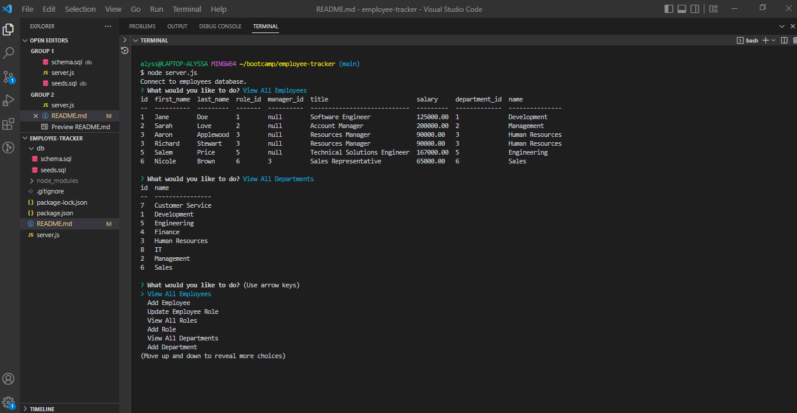

# Employee Tracker

Module 12: MySQL

## Table of Contents
1. [Description](#description)
2. [Usage](#usage)
3. [Visuals](#visuals)

## Description
This is a command-line application that will manage a company's employee database, using Node.js, Inquirer, and MySQL. This is an application demonstrates how content managment systems (CMS) are created by developers to allow non-developers to interact with databases.

[GitHub Repository](https://github.com/alyssa20lopez/employee-tracker)

## Usage
To use this application, first clone the project and navigate to VS Code. In the command-line, install the following packages:
- npm i inquirer@8.2.4
- npm i console.table
- npm i express
- npm i mysql2

To start the application, type 'node server.js' in the command-line.
## Visuals
Here is a visual and link to the walkthrough video for the command-line application.

<!-- Link to Walkthrough Video -->
[Walkthrough Video!](https://drive.google.com/file/d/1zwZPsPfbgun1f5yWXtOh9yfL065dR5R9/view)
